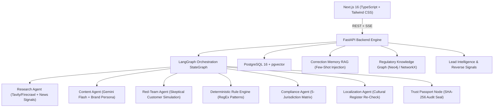

# HALLMARK (AEGIS) — The Trust Engine for Autonomous Insurance Marketing

> **AI can generate the message. HALLMARK proves it.**

HALLMARK is an end-to-end, production-grade InsurTech marketing intelligence and governance platform built for the **JA Assure Hackathon**. It orchestrates autonomous multi-agent pipelines with LangGraph, deterministic multi-jurisdiction regulatory rule sets, red-team adversarial customer simulations, pgvector-backed correction memory RAG, and cryptographic Trust Passport verification.

---

## 🏛️ System Architecture



---

## 🌟 Core Pillars

### 1. 5-Jurisdiction Native Compliance (Not One Single Rubric)
JA Assure operates across 5 Southeast Asian regulatory environments:
- **Singapore (MAS)**: Enforces Notice 125 intermediary disclosures & bans absolute payout guarantees.
- **Malaysia (BNM)**: Enforces Policy PD 029-2 superlative bans & conventional vs. Takaful delineations.
- **Hong Kong (HKIA)**: Enforces GL10 marketing guidelines & GL28 investment language bans.
- **Indonesia (OJK)**: Enforces SEOJK.05/2020 strict prohibition on *"pasti"* guarantee terms & Bahasa language mandates.
- **Thailand (OIC)**: Enforces Notification B.E. 2551 buyer comprehension notice & formal honorific register.

### 2. Red-Team Adversarial Customer Simulation
Before any marketing copy reaches compliance or human review, an adversarial customer simulation reads it with zero context to detect overclaims, misleading turnaround promises, and implied guarantees that insurance products cannot legally make.

### 3. Human-in-the-Loop 2-Click Rejection + pgvector Correction Memory
Every human rejection with reason tags (`overclaim`, `too_salesy`, `wrong_cta`, `off_brand`, `inaccurate_claim`, `compliance_risk`, `bad_localization`) is vectorized into pgvector memory. Future generations retrieve these corrections via semantic cosine similarity to self-heal and avoid repeated mistakes.

### 4. Regulatory & Evidence Knowledge Graph (Neo4j & NetworkX)
A visual, queryable graph linking Evidence Sources → Brand Claims → Regulatory Rules → Regulators → Risk Scenarios, complete with a Cypher query terminal.

### 5. Cryptographic Trust Passport
Every approved marketing asset receives a tamper-evident audit passport with a cryptographic SHA-256 hash, evidence lineage citations, model audit ID, and regulatory verification stamps.

---

## 🚀 Quick Start

### Prerequisites
- Python 3.11+ (tested on Python 3.14)
- Node.js 20+
- PostgreSQL with pgvector (optional: runs with fallback SQLite/demo data if unconfigured)
- Neo4j (optional: falls back to native high-speed NetworkX graph engine)

### 1. Clone & Configure
```bash
git clone https://github.com/iamroyce007/HALLMARK-JA-ASSURE-GCICI.git
cd HALLMARK-JA-ASSURE-GCICI
cp .env.example .env
```

### 2. Start Backend (FastAPI + LangGraph)
```bash
# Install dependencies
pip install -r backend/requirements.txt

# Run database migrations & seed demo data
PYTHONPATH=backend python3 -m app.seed

# Start server
PYTHONPATH=backend python3 -m uvicorn app.main:app --host 0.0.0.0 --port 8000 --reload
```

Backend API available at: `http://localhost:8000` (Swagger docs: `http://localhost:8000/docs`)

### 3. Start Frontend (Next.js 16)
```bash
cd frontend
npm install
npm run dev
```

Frontend application available at: `http://localhost:3000`

---

## 🧪 Running Automated Tests

```bash
PYTHONPATH=backend pytest backend/tests/ -v
```

All 6 test suites cover:
- Deterministic Rule Engine absolute guarantee detection
- Hedged copy compliance pass
- Multi-jurisdiction matrix SG vs. ID rules
- Red-Team adversarial customer simulation
- Knowledge Graph structure & Cypher query execution
- Correction Memory pgvector retrieval

---

## 🏆 Hackathon Demonstration Flow
1. Open **Command Center** on `http://localhost:3000` to review live KPIs.
2. Click **Run 1-Click Demo** to execute Cycle 1 (flawed ad with speed overclaim).
3. Observe live agent events streaming in real time via SSE.
4. Navigate to **Review Queue** to see the 2-Click rejection interface with Red-Team customer critique.
5. Click **Reject & Train Memory** with tag `overclaim`.
6. Watch Cycle 2 autonomously regenerate with hedged disclaimers, passing 5/5 regulators and receiving a cryptographic **Trust Passport**!
